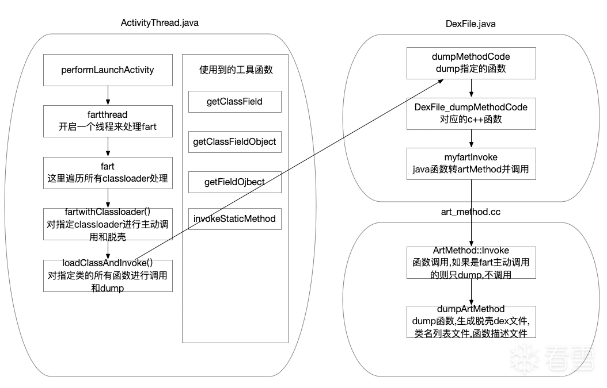

### DexFile.java添加一个native函数在下面文件中实现
``` java
    private static native void dumpMethodCode(Object m);
```
### dalvik_system_DexFile.cc添加一个函数
``` c++
static void DexFile_dumpMethodCode(JNIEnv* env, jclass,jobject method) {
ScopedFastNativeObjectAccess soa(env);
  if(method!=nullptr)
  {
		  ArtMethod* artmethod = ArtMethod::FromReflectedMethod(soa, method);
		  //FromReflectedMethod 可以由Method对象得到这个方法对应的ArtMethod的真正其实地址。然后把它强转为ArtMethod支持，从而对所有成员进行修改。
		  myfartInvoke(artmethod);
	  }	  


  return;
}
```

### ActivityThread.java是fart的入口文件

添加的工具函数
``` java
    public static Field getClassField(ClassLoader classloader, String class_name,String filedName);
    public static Object getClassFieldObject(ClassLoader classloader, String class_name, Object obj,String filedName);
    public static Object invokeStaticMethod(String class_name,String method_name, Class[] pareTyple, Object[] pareVaules);
    public static Object getFieldOjbect(String class_name, Object obj,String filedName);
```
在performLaunchActivity函数末尾添加fart启动线程函数： fartthread();
fart执行链
    performLaunchActivity()-> public static void fartthread()-> public static void fart()-> public static ClassLoader getClassloader()->
    public static void loadClassAndInvoke(ClassLoader appClassloader, String eachclassname, Method dumpMethodCode_method);


``` java
     public static void loadClassAndInvoke(ClassLoader appClassloader, String eachclassname, Method dumpMethodCode_method);
     //获取dumpMethodCode_method的构造函数和普通函数列表并且调用dumpMethodCode_method.invoke()

      public static ClassLoader getClassloader();
      //通过反射获取classloader
      //android.app.ActivityThread(currentActivityThread)->(mBoundApplication)->(android.app.ActivityThread$AppBindData)->(info)->mApplication
     public static void fart();
     //获取classloader的dexfile的getclassNamelist函数拿到dex对象的类列表然后给loadClassAndInvoke调用。
```

### art_method.cc
```
	extern "C" void myfartInvoke(ArtMethod * artmethod)
	 SHARED_LOCKS_REQUIRED(Locks::mutator_lock_) {
		JValue *result = nullptr;
		Thread *self = nullptr;
		uint32_t temp = 6;
		uint32_t *args = &temp;
		uint32_t args_size = 6;
		artmethod->Invoke(self, args, args_size, result, "fart");
	}

extern "C" void dumpArtMethod(ArtMethod * artmethod) SHARED_LOCKS_REQUIRED(Locks::mutator_lock_) 
extern "C" void dumpDexFileByExecute(ArtMethod * artmethod) SHARED_LOCKS_REQUIRED(Locks::mutator_lock_) 
```
``` c++
extern "C" char *base64_encode(char *str, long str_len,
                long *outlen) {
long len;
char *res;
int i, j;
const char *base64_table =
    "ABCDEFGHIJKLMNOPQRSTUVWXYZabcdefghijklmnopqrstuvwxyz0123456789+/";
if (str_len % 3 == 0)
    len = str_len / 3 * 4;
else
    len = (str_len / 3 + 1) * 4;

res = (char *) malloc(sizeof(char) * (len + 1));
res[len] = '\0';
*outlen = len;
for (i = 0, j = 0; i < len - 2; j += 3, i += 4) {
    res[i] = base64_table[str[j] >> 2];
    res[i + 1] =
        base64_table[(str[j] & 0x3) << 4 |
                (str[j + 1] >> 4)];
    res[i + 2] =
        base64_table[(str[j + 1] & 0xf) << 2 |
                (str[j + 2] >> 6)];
    res[i + 3] = base64_table[str[j + 2] & 0x3f];
}

switch (str_len % 3) {
case 1:
    res[i - 2] = '=';
    res[i - 1] = '=';
    break;
case 2:
    res[i - 1] = '=';
    break;
}

return res;
}

uint8_t *codeitem_end(const uint8_t ** pData) {
    uint32_t num_of_list = DecodeUnsignedLeb128(pData);
    for (; num_of_list > 0; num_of_list--) {
        int32_t num_of_handlers =
            DecodeSignedLeb128(pData);
        int num = num_of_handlers;
        if (num_of_handlers <= 0) {
            num = -num_of_handlers;
        }
        for (; num > 0; num--) {
            DecodeUnsignedLeb128(pData);
            DecodeUnsignedLeb128(pData);
        }
        if (num_of_handlers <= 0) {
            DecodeUnsignedLeb128(pData);
        }
    }
    return (uint8_t *) (*pData);
}
```

### iterpreter.cc 
``` c++
static JValue Execute(Thread* self, const DexFile::CodeItem* code_item, ShadowFrame& shadow_frame,
                      JValue result_register)
    SHARED_LOCKS_REQUIRED(Locks::mutator_lock_);

static inline JValue Execute(Thread* self, const DexFile::CodeItem* code_item,
                             ShadowFrame& shadow_frame, JValue result_register) {
								 
								 
  if(strstr(PrettyMethod(shadow_frame.GetMethod()).c_str(),"<clinit>")!=nullptr)
  {
	  dumpDexFileByExecute(shadow_frame.GetMethod());
	  }
```
### 移植fart到android11上
地址：http://www.yxfzedu.com/article/9696

合并mcookie
执行主动调用的前提是获取到当前的所有类，以及类对应的所有方法。
fart通过遍历dexElements获取DexFile，当mCookie被隐藏时将无法搜索到对应dexfile结构，腾讯抽取壳在android版本小于10时，
DexFile，mCookie不加入原PathList dexElements，在自定义类加载器维护PathList。
壳处理的核心逻辑是：
//private static native Class defineClassNative(String name, ClassLoader loader, Object cookie)
在加载dex时，保存DexFile和mCookie，同时会hoook（重新注册）defineClassNative，指向自定义函数，当findclass时，进入自定义defineClassNative函数，先调用原defineCLassNative函数看是否能返回class，不能用保存的cookie和DexFile替换defineClassNative
的最后两个参数，Cookie和DexFile在defineClassNative一次，这样达到不加入BaseDexLoader PathList的dexElements中也能加载class
这里考虑所有的DexFile，然后合并mCookie去做处理。首先在defineClassNative插装，收集所有DexFile指针，将其转化为mCookie1(long[] )
返回给java层，合并反射获得的mCookie2为mCookie，然后使用原有逻辑获取类列表，遍历加载类的所有函数，然后dump


